# Отчет по отладке приложения Selectel

## 1. Start try.
    При первичном беглом просмотре проекта я сразу заметил некоторые ошибки. Например: устаревший подход on_event.
    Но решил всё же начать с запуска и сразу столкнулся с проблемой: 

Ошибка при первом запуске

    Видим ошибку в классе Settings. Открыв файл config.py, заметил что в названии переменной из /.env есть ошибка. Исправил ее. 
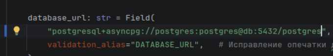
Fix ошибки

    Пока исправлял первую ошибку увидел так же "postgres_typo". Исправил. 

## 2. "city_name".
    Приложение запустилось. Но сразу выкинуло ошибку:
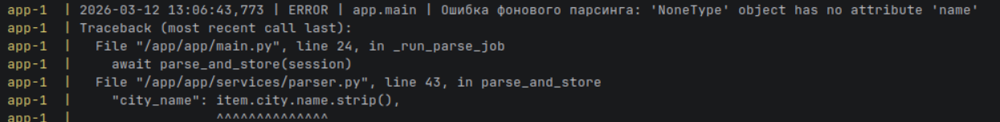
Ошибка "city_name": item.city.name.strip()

    Открыл services/parser.py и долго не мог понять проблемы. Потом увидел example.json и понял, что city может быть None. Исправил функцию parse_and_store. 

Исправление функции parse_and_store

## 3. Second or minutes?..
    Парсер выдавал нормальную работу, Но терминал буквально летeл от частоты парсинга, решил уменьшить частоту и понял, что это тоже ошибка.
    Зайдя в scheduler, я увидел `seconds=settings.parse_schedule_minutes`. Ошибка нашлась сама собой. 

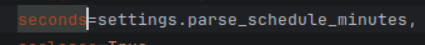
Ошибка частоты парсинга
    
    Исправил на минуты:

## 4. lifespan. 
    Дальше решил взяться за файл main, а именно за функцию on_event.
    На своих проектах чуть ли не "Собаку съел" по этой теме. И интернет убедил меня в том, что lifespan лучше. Как минимум потому что позволяет избавится от глобальной переменной _scheduler.

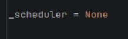 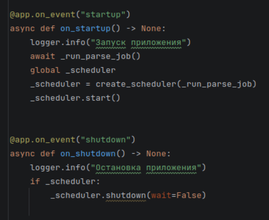
on_event функция

    Версия c lifespan.
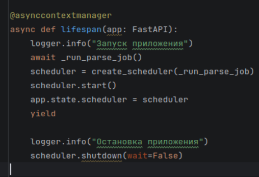
версия c lifespan

## 5. AsyncGenerator.
    Pacharm показывал мне красные линии на импортах, поэтому решил создать виртуальное окружение. Глянул для начала requirements.txt - увидел интересную версию fastapi 999.0.0 👍. 
    Стер эту строку, так как в верху файла есть нормальный fastapi. Создал .venv, установил зависимости и как-будто черным по белому всплыли желтые линии)) 
    Первое, что увидел в явной типизации функции get_session отсутсвует AsyncGenerator. Исправил в api/v1/parse.py и vacanciec.py:
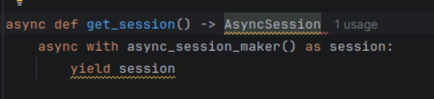 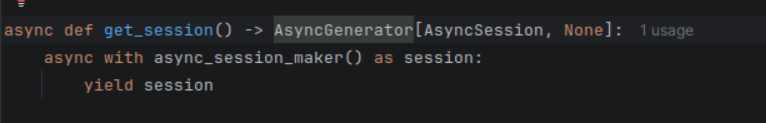
Было/Стало

## 6. response_model
    В vacancies.py увидел кучу подчеркиваний. Ошибка была в том, что возвращаем не в формате response_model. Да и в целом "return метод круда" выглядит ужасно. Поэтому начал исправлять.
    Просто использовал метод model_validate который приводит к нужному типу. 
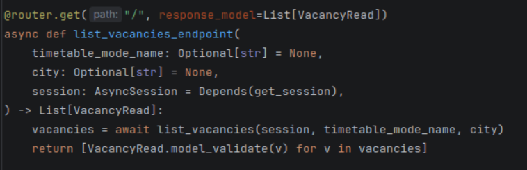

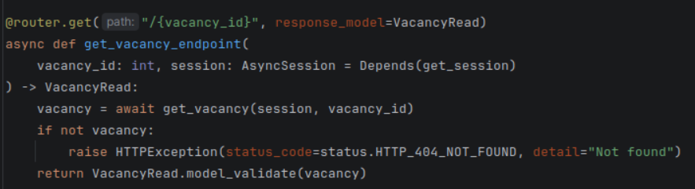 

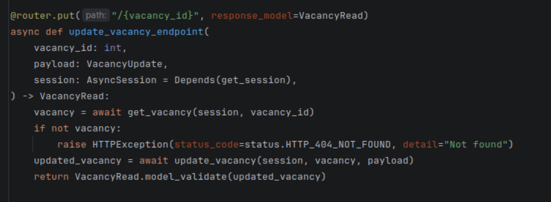 

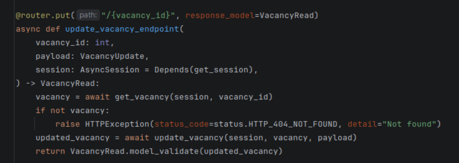

    Стоит отметить так же, что вероятно стоит обернуть работу с методами круда в try except, добавить в них rollback(),
    но для этого надо менять всё, включая круды, но не уверен, что это вписывается в суть тестового задания, поэтому оставил пока как есть.

## 7. raise HTTPException
    Так же подчеркивало функцию return JSONResponse(, типизация указывала только VacancyRead, которая имеет другой тип данных, поэтому IDE на это ругалась. 
    Заменил на raise HTTPException, так как это не возращаемое значение, а исключение, которое не является типом данных. Так же странным показался код 200 при таком исходе, GPT подсказал, что тут нужен 409.
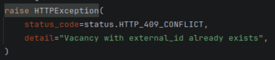

## 8 set or dict?..
    Посчитал логичным перейти к crud. В целом я уже выше описал проблематику этого файла, но решил поискать ошибки еще. В целом всё выглядело не плохо, кроме функции upsert_external_vacancies.
    Он выглядело громостко и сложно, решил сразу вбить в GPT, а он сразу же показал ошибку в том, что в первмо сценарии мы можем возвращать либо сет либо дикт. И явно dict здесь ошибочный, 
    так как сет показывает более быструю работу в данном случае.
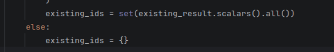 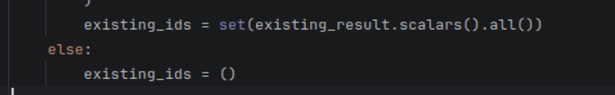
Было / Стало

    Так же ИИ сказал, что мы слишком часто юзаем select в бд и в самом деле: в первый раз когда проверяем бд на наличие спаршенных и потом еще в цикле на каждый из этих же, что увеличает сложность функции. 
    И всё в этом же ответе)) ИИ дает функцию в которой сохраняются id в список и лишние запросы больше не нужны. Но я решил не исправлять так сильно, потому как не уверен, что и это вписывается в рамки заданий.

## КонеЦц)
    Вероятно 8 ошибок - отличный повод закончить работу) Конечно остались еще замечания, но это либо неиспользуемые импорты либо что-то в стиле "Я бы переписал тут архитектуру вот так...")
    Благодарю за возможность показать себя. Потратил много времени на этот анализ и оно того стоило. Где-то подтянул знания, где-то понял, что я молодец. С нетерпением жду следующей с Вами свзяи.

    

    
